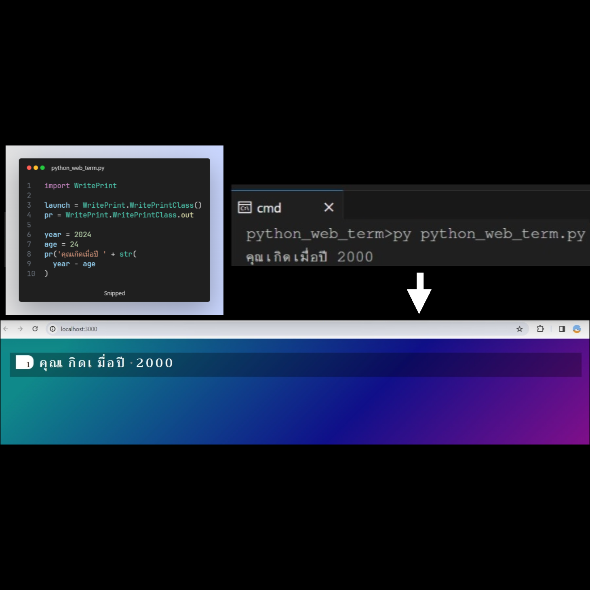

# python-terminal-mono-thai

this project is intend to specifically handle python output in thai language that still be able to display monospace-positioning in prettier font than those existing monospace thai language out there

## prerequisite
- nodejs
- npm library `live-server`
- python compiler

## how this works

- to begin with, clone or download zip file of this repository
- then copy folder 'output' and 'WritePrint' to the folder where your python file is located
- next, add following lines in your python code:

```py
import WritePrint

launch = WritePrint.WritePrintClass()
pr = WritePrint.WritePrintClass.out
```

- these instruction will makes you write `print` command in python shorter, so whenever you want to `print` something in python code, just replace it with the shorter version `pr` (for example, `pr('hello')` instead of `print('hello')`
- after that use the npm library `live-server` if you didn't have this installed globally, open terminal and run

```
npm i -g live-server
```

- after the libray is installed, in your terminal, navigate to the directory that contains the folder 'output' from this repository and run

```
npx live-server --host=localhost --port=3000
```

- at this point, the browser should automatically open to the address `http://localhost:3000`, the suggested windows layout after the browser appear is to have your browser to be side-by-side with your terminal running python code (or even better, use your IDE's integrated terminal and have your IDE side-by-side with the browser)
- now, whenever you want to run your python code (if you want to run your python code in a terminal, make sure not to close the `live-server` instance of your termianl, but to open a new tab or new window of your terminal instead, but if you use your IDE's integrated terminal, then there's nothing to worry) just normally run somehing like `py [your-python-code].py` and see the result live-updated in the browser
